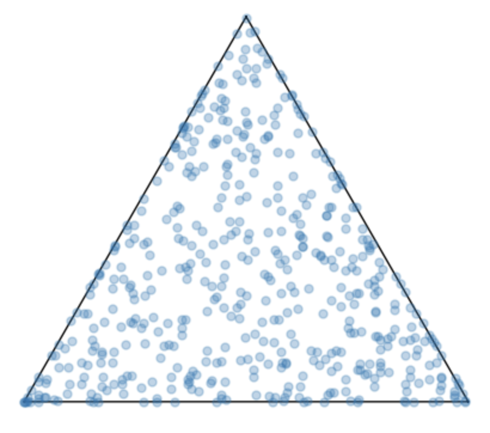

# HYDRA

#### This is the official repository of the paper "Flexible Generation of Preference Data for Recommendation Analysis" accepted at KDD 2025 [[Paper]](https://arxiv.org/abs/2407.16594)
HyDRA is a novel model for generating realistic and flexible synthetic preference data—crucial for simulating and
analyzing recommendation systems in controlled environments.
Building effective recommender systems requires high-quality synthetic data that mirrors real-world user behavior.
HyDRA delivers on this by modeling: (i) User-item interaction intensity, (ii) Item popularity dynamics, 
(iii) User engagement patterns.
It creates user communities that mimic social influence and shared item adoption, as well as simulate
popularity and engagement using mixtures of distributions, offering greater realism and diversity.

## Approach
HyDRA generates synthetic datasets by simulating:
1. **User Engagement** — Modeled with long-tail (e.g., power-law, exponential) distributions.
> - Draw user distribution choice $k \sim \textrm{Discrete}(\pi)$

2. **Item Popularity** — Simulated similarly via customizable probabilistic priors.
> - Draw item distribution choice $h \sim \textrm{Discrete}(\psi)$

3. **User-Item Matching** — Based on latent Dirichlet-distributed feature vectors.
> - For $u \in U$:
>    - Draw $\rho_u \sim \text{Dirichlet}(10 \cdot \mu_u^\rho)$, where $\mu_u^\rho \sim \text{Dirichlet}(\mathbf{1}_f)$
>    - Draw $\varrho_u \sim \text{Beta}'(z_u / m, \sigma_u)$, where $z_u \sim P_{\theta_k}$
> - For $i \in I$
>    - Draw $\alpha_i \sim \textrm{Dirichlet}(0.1 \, \mu_i^\alpha), \,\ \mbox{where } \mu_i^\alpha \sim \textrm{Dirichlet}(\mathbf{100}_f)$
>    - Draw $\varphi_i \sim \mathit{Beta}'(y_i/n, \sigma_i), \; \mbox{where } y_i \sim P_{\vartheta_h}$

  

User (left) and item (right) representations within a three-dimensional feature space, according to the proposed User-Item Matching model. Users are evenly distributed within the latent space. By contrast, item samples tend to concentrate along specific subsets of the latent features, representing edges/corners in the feature space.

> - For $u \in U$ and $i \in I$:
>   - If $\textrm{Bernoulli} \big(\lambda\cdot \rho_u^\top \alpha_i \cdot \varrho_u \cdot \varphi_i \big)$ then: Generate $(u,i)$


## Usage

> Make sure you have Python 3.8+ and the required packages installed:  
> pip install -r requirements.txt

---

## 1. Generate Synthetic Dataset

```bash
python main.py <dataset_name>
```

- **`<dataset_name>`**  
  Name of the JSON file (without `.json`) in `config/`, e.g. `power_law_power_law`.  
  Reads `config/<dataset_name>.json`, generates users/items/interactions, and saves to  
  `data_generation_files/<dataset_name>_<params…>/`.

- **Config parameters** (inside `config/<dataset_name>.json`):
  ```jsonc
  {
    "dataset_name": "power_law_power_law",
  
    "pi": "power_law", // Power-law distribution for users
    "theta_first_param": 1.5, // User distribution parameter #1
    "theta_second_param": 0.0, // User distribution parameter #2
    "pi_xmax": -1, // Max value sampled from distribution pi
    "pi_xmin": 1, // Min value sampled from distribution pi
    "zeta": 1.2, // Variable for density manipulation
  
    "psi": "power_law", // Power-law distribution for users
    "vartheta_first_param": 1.5, // Item distribution parameter #1
    "vartheta_second_param": 0.0, // Item distribution parameter #2
    "psi_xmax": -1, // Max value sampled from distribution psi
    "psi_xmin": 1, // Min value sampled from distribution psi
    "xi": 1.2, // Variable for density manipulation
  
    "Lambda": 8000, // Variable for density manipulation
    "delta": 1.0, // Noisy level injection (1.0 means no noise)

    "num_users": 6000,
    "num_items": 5000,
    "num_attrs": 64,
    "tau": 1, // Min size for users histories

    "ETA_users": "1.0", // Single user population
    "ETA_items": "1.0", // Single item population
    "EPSILON": 0.02 // Intersection level between populations
  }
  ```

---

## 2. Estimate Distribution Parameters

```bash
python estimation.py \
  -d <dataset> \
  -o <objective> \
  -ud <user_dist> \
  -id <item_dist>
```

- **`-d`, `--dataset`**  
  Name of a dataset. Example:  
  - `movielens-1m` (automatically downloads from GroupLens)  
  - `amazon` (expects `real_data/amazon/...` to exist)

- **`-o`, `--objective`**  
  - `longtails` — fit user/item degree distributions  
  - `preferences` — fit rating/value distributions
  - `both` 

- **`-ud`, `--user_dist`** & **`-id`, `--item_dist`**  
  One of `PowerLaw`, `Exponential`, `StretchedExponential`, `Lognormal`.

- **Example:**
  ```bash
  python estimation.py \
    -d movielens-1m \
    -o longtails \
    -ud PowerLaw \
    -id Lognormal
  ```

- **Output:**
  - Estimated parameters printed to console  
  - (Optional) Saves parameters and plots to `estimation_files/<dataset>_<params>/`

---

## 3. Evaluate Recommender Systems

```bash
python recsys.py <dataset>
```

- **`<dataset>`**  
  E.g. **python recsys.py power_law_power_law**, after generation you might have:
  ```text
  data_generation_files/
    power_law_power_law
  ```

- **Built-in models from RecBole:**  
  - `Pop`
  - `ItemKNN`
  - `BPR`  
  - `NeuMF`  
  - `MultiVAE`

- **Output:**
  - A CSV of recall/Hit@{5,10,20} per model in `recbole/<dataset>/`

## Cite us
If you use HYDRA in your research, please cite our KDD 2025 paper:

```bibtex
@misc{mungari2025flexiblegenerationpreferencedata,
      title={Flexible Generation of Preference Data for Recommendation Analysis}, 
      author={Simone Mungari and Erica Coppolillo and Ettore Ritacco and Giuseppe Manco},
      year={2025},
      eprint={2407.16594},
      archivePrefix={arXiv},
      primaryClass={cs.IR},
      url={https://arxiv.org/abs/2407.16594},
}
